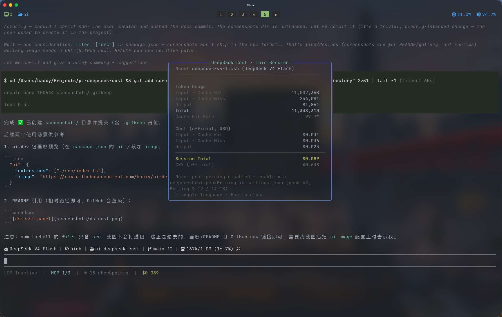

# pi-deepseek-cost

[](https://www.npmjs.com/package/pi-deepseek-cost)
[](https://pi.dev/packages)

> [简体中文](README_ZH.md)

> A [Pi](https://pi.dev) extension that tracks your **DeepSeek usage & cost** — live session cost in the status bar, a `/ds-cost` overlay panel, bilingual UI (中文/English) with currency switching, and official peak/off-peak billing.

## Screenshots




## Features

- **Status bar**: live cumulative cost for the current session (`¥0.019`), refreshed after every turn — cost only, no noise (an empty session shows `¥0`)
- **`/ds-cost`**: floating overlay panel — per-model token usage (cache-hit / cache-miss input, output), cache hit rate, CNY/USD cost breakdown, peak-hour split, USD↔CNY cross-reference
- **Model-aware**: active only when the model runs on the **native DeepSeek provider** (`provider: "deepseek"` — i.e. billed by DeepSeek itself); DeepSeek models served through other providers or gateways (OpenRouter, OpenAI-compatible proxies, …) keep the extension invisible, since only official DeepSeek billing can be priced here
- **Bilingual + currency**: zh → ¥ (CNY), en → $ (USD). Switch inside the panel with `L`, or globally with `Ctrl+Shift+L`
- **Official peak/off-peak pricing**: intrinsic — each message is charged at the peak (×2) or off-peak rate of its own timestamp (UTC 01:00–04:00 & 06:00–10:00)

## Installation

```bash
# from npm
pi install npm:pi-deepseek-cost
# or from a git repo
pi install git:github.com/hacxy/pi-deepseek-cost
# or local path
pi install ./pi-deepseek-cost
```

> **Security:** as with any Pi package, review the source before installing — extensions run with full system access.

Requires:

- A recent Pi installation
- DeepSeek models configured with an API key (`DEEPSEEK_API_KEY`, provider `deepseek` — models `deepseek-v4-flash`, `deepseek-v4-pro`)

## Usage

| Action                  | How                                                                    |
| ----------------------- | ---------------------------------------------------------------------- |
| View session cost       | Watch the status bar (updates after each turn)                         |
| Detailed cost panel     | `/ds-cost` (Esc to close, `L` to switch language)                      |
| Switch language (zh↔en) | `L` inside a panel, or `Ctrl+Shift+L` (rebindable in keybindings.json) |
| Set language in config  | `deepseekCost.locale` in settings.json                                 |

## Configuration

In `~/.pi/agent/settings.json` (global) or `.pi/settings.json` (project, overrides):

```json
{
  "deepseekCost": {
    "locale": "zh"
  }
}
```

| Key      | Default | Description                                                      |
| -------- | ------- | ---------------------------------------------------------------- |
| `locale` | `"zh"`  | UI language: `"zh"` or `"en"`. Currency follows (zh → ¥, en → $) |

Config edits take effect immediately (re-read on every calculation).

> Peak/off-peak pricing is **not** configurable: DeepSeek bills peak ×2 during 01:00–04:00 and 06:00–10:00 UTC (off-peak is exactly half of peak). Legacy `peakPricing` / `peakMultiplier` / `peakHours` keys in settings.json are silently ignored and can be removed.

### Peak pricing details

Peak/off-peak pricing is official and always in effect. Each message is charged against **its own timestamp**: peak-hour messages at the peak rate (×2), off-peak at the off-peak rate — mixed sessions split precisely (the `/ds-cost` panel always shows off-peak / peak rows). Time is always evaluated in UTC, matching DeepSeek's official definition (01:00–04:00 and 06:00–10:00 UTC, i.e. Beijing 09:00–12:00 and 14:00–18:00).

## Cost basis

- Token numbers come from the real `usage` blocks Pi persists on messages (`input` = cache-miss input, `cacheRead` = cache-hit input, `output`), matching DeepSeek API's `prompt_cache_hit_tokens` / `prompt_cache_miss_tokens` / `completion_tokens`
- CNY and USD both use DeepSeek's official per-million-token prices as printed on the [pricing page](https://api-docs.deepseek.com/quick_start/pricing) (≈¥6.9/$). Off-peak is exactly half of peak.

| Model               | Period   | Input · cache miss | Input · cache hit  | Output            |
| ------------------- | -------- | ------------------ | ------------------ | ----------------- |
| `deepseek-v4-flash` | Off-peak | ¥1.5 / M ($0.22)   | ¥0.05 / M ($0.007) | ¥4.5 / M ($0.66)  |
|                     | Peak ×2  | ¥3 / M ($0.44)     | ¥0.10 / M ($0.014) | ¥9 / M ($1.32)    |
| `deepseek-v4-pro`   | Off-peak | ¥4.5 / M ($0.66)   | ¥0.15 / M ($0.022) | ¥13.5 / M ($1.98) |
|                     | Peak ×2  | ¥9 / M ($1.32)     | ¥0.30 / M ($0.044) | ¥27 / M ($3.96)   |

> `deepseek-chat` / `deepseek-reasoner` are deprecated (since 2026-07-24) and priced at the V4 Flash rates — kept so older persisted sessions still show correct costs.

- Cost is computed per model (model switches mid-session aggregate correctly); `toolResult` / compaction usage uses the last known model
- Session totals rebuild from the session file, so they stay accurate after `/resume`

## Development

```bash
pnpm install
pnpm dev          # run in pi with hot reload (pi -e ./src/index.ts)
pnpm test         # vitest unit tests
pnpm typecheck
pnpm lint
pnpm format
```

## Release

```bash
pnpm release [patch|minor|major]   # bump, push, and watch the CI publish (default: patch)
```

Bumps the version via `npm version` (commit + `vX.Y.Z` tag), pushes `main` + tags, then watches the `publish.yml` CI run: lint → typecheck → test → `npm publish` (npm trusted publishing — no tokens) → changelogithub GitHub Release. Use `pnpm release --dry` to preview the commands without running them.

## License

MIT
