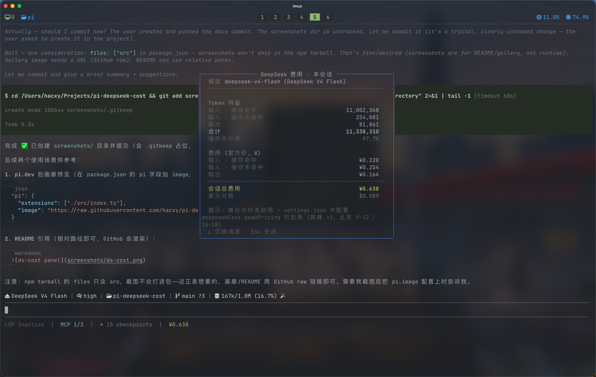

# pi-deepseek-cost

[](https://www.npmjs.com/package/pi-deepseek-cost)
[](https://pi.dev/packages)

> [English](README.md)

> 一个 [Pi](https://pi.dev) 扩展：追踪你的 **DeepSeek 用量与费用** —— 状态栏实时显示会话累计费用，`/ds-cost` 浮动弹窗，中英双语（货币随语言切换），官方峰谷计费。

## 截图




## 功能特性

- **状态栏**：实时显示当前会话累计费用（`¥0.019`），每轮结束后更新 —— 仅费用，无噪音（空会话显示 `¥0`）
- **`/ds-cost`**：浮动弹窗 —— 分模型 token 用量（缓存命中/未命中输入、输出）、缓存命中率、CNY/USD 费用明细、峰谷拆分、美元↔人民币对照
- **模型感知**：仅对 **DeepSeek 原生供应商**生效（`provider: "deepseek"`，即由 DeepSeek 官方计费）；经其他供应商或网关（OpenRouter、OpenAI 兼容代理等）提供的 DeepSeek 模型同样隐身——本扩展只按 DeepSeek 官方计费口径计价
- **中英双语 + 货币联动**：中文 → ¥（人民币），英文 → $（美元）。在弹窗内按 `L` 切换，或全局快捷键 `Ctrl+Shift+L`
- **官方峰谷计价**：固有生效 —— 每条消息按自身 timestamp 的时段（高峰 ×2 / 平时）计费（北京 09:00–12:00 与 14:00–18:00）

## 安装

```bash
# 从 npm
pi install npm:pi-deepseek-cost
# 或从 git 仓库
pi install git:github.com/hacxy/pi-deepseek-cost
# 或本地路径
pi install ./pi-deepseek-cost
```

> **安全提示**：与所有 Pi 包一样，安装前请审查源码 —— 扩展拥有完整的系统权限。

前置条件：

- 较新的 Pi 安装
- 已配置 DeepSeek 模型与 API key（`DEEPSEEK_API_KEY`，provider 为 `deepseek` —— 模型 `deepseek-v4-flash`、`deepseek-v4-pro`）

## 使用

| 操作              | 方式                                                            |
| ----------------- | --------------------------------------------------------------- |
| 查看会话费用      | 观察状态栏（每轮结束后更新）                                    |
| 费用详情弹窗      | `/ds-cost`（Esc 关闭，`L` 切换语言）                            |
| 切换语言（中↔英） | 弹窗内按 `L`，或 `Ctrl+Shift+L`（可在 keybindings.json 自定义） |
| 在配置中设置语言  | settings.json 的 `deepseekCost.locale`                          |

## 配置

在 `~/.pi/agent/settings.json`（全局）或 `.pi/settings.json`（项目，覆盖全局）：

```json
{
  "deepseekCost": {
    "locale": "zh"
  }
}
```

| 配置项   | 默认值 | 说明                                                    |
| -------- | ------ | ------------------------------------------------------- |
| `locale` | `"zh"` | UI 语言：`"zh"` 或 `"en"`。货币随语言（zh → ¥，en → $） |

配置修改即时生效（每次计算都会重新读取）。

> 峰谷计价**不可配置**：DeepSeek 在北京 09:00–12:00 与 14:00–18:00 按高峰 ×2 计费（平时恰好是高峰的一半）。settings.json 中遗留的 `peakPricing` / `peakMultiplier` / `peakHours` 键会被静默忽略，可删除。

### 峰谷计价细节

峰谷计价为官方规则、始终生效。每条消息按**自身 timestamp** 计费：高峰时段消息按高峰费率（×2），平时按平时费率 —— 混合时段会话精确拆分（`/ds-cost` 面板始终显示平时/高峰两行）。时间按北京时间判定，与 DeepSeek 官方定义一致（09:00–12:00 与 14:00–18:00）。

## 计费口径

- token 数直接取自 Pi 在会话中持久化的 `usage` 字段（`input` = 缓存未命中输入，`cacheRead` = 缓存命中输入，`output` = 输出），与 DeepSeek API 的 `prompt_cache_hit_tokens` / `prompt_cache_miss_tokens` / `completion_tokens` 一一对应
- 人民币与美元均采用 [官方定价页](https://api-docs.deepseek.com/zh-cn/quick_start/pricing/) 刊印的每百万 token 单价（≈¥6.9/$）。平时恰好是高峰的一半。

| 模型                | 时段    | 输入 · 缓存未命中 | 输入 · 缓存命中    | 输出              |
| ------------------- | ------- | ----------------- | ------------------ | ----------------- |
| `deepseek-v4-flash` | 平时    | ¥1.5 / M ($0.22)  | ¥0.05 / M ($0.007) | ¥4.5 / M ($0.66)  |
|                     | 高峰 ×2 | ¥3 / M ($0.44)    | ¥0.10 / M ($0.014) | ¥9 / M ($1.32)    |
| `deepseek-v4-pro`   | 平时    | ¥4.5 / M ($0.66)  | ¥0.15 / M ($0.022) | ¥13.5 / M ($1.98) |
|                     | 高峰 ×2 | ¥9 / M ($1.32)    | ¥0.30 / M ($0.044) | ¥27 / M ($3.96)   |

> `deepseek-chat` / `deepseek-reasoner` 已废弃（2026-07-24 起），按 V4 Flash 费率计价 —— 保留映射以便旧会话持久化的用量仍能正确计费。

- 费用按模型分别计算（会话中切换模型也能正确累计）；`toolResult` / compaction 等无模型标记的用量按最近模型计费
- 会话总额从会话文件重建，`/resume` 后依然准确

## 开发

```bash
pnpm install
pnpm dev          # 在 pi 中以热重载运行（pi -e ./src/index.ts）
pnpm test         # vitest 单元测试
pnpm typecheck
pnpm lint
pnpm format
```

## 发布

```bash
pnpm release [patch|minor|major]   # 升级版本、推送并监听 CI 发布（默认 patch）
```

通过 `npm version` 升级版本（提交 + `vX.Y.Z` tag），推送 `main` 与 tag，然后监听 `publish.yml` CI 运行：lint → typecheck → test → `npm publish`（npm 信任发布，无需 token）→ changelogithub 生成 GitHub Release。用 `pnpm release --dry` 可预览要执行的命令而不实际运行。

## 许可证

MIT
